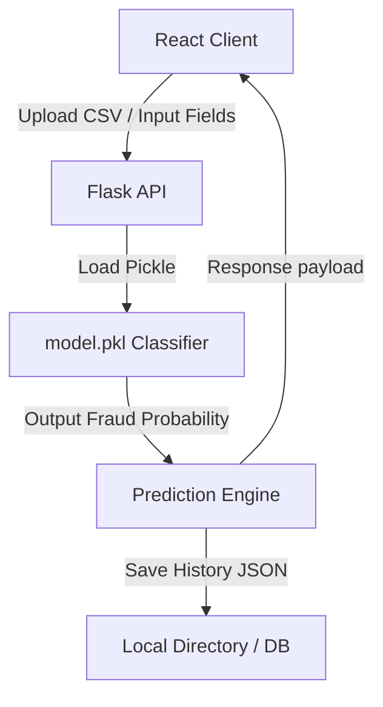

<div align="center">

# 🛡️ Credit Card Fraud Detection

### ML Intelligent Transaction Analyzer · Full-Stack Security Dashboard

[](https://python.org)
[](https://flask.palletsprojects.com/)
[](https://react.dev)
[](https://scikit-learn.org)
[](https://recharts.org)

**Credit Card Fraud Detection** is a full-stack financial monitoring application. It runs a custom machine learning classifier trained to flag suspicious credit card transactions. Features interactive charts, bulk CSV processing pipelines, and risk dashboards.

*RandomForest Classifier · Real-Time Prediction API · Batch CSV Uploads · Analytics & Risk Indicators*

</div>

---

## ✨ Key Features

| Feature | Description |
|---------|-------------|
| 🧠 **ML Scoring Pipeline** | Evaluates transactions through PCA-transformed metrics to detect anomalies in real time. |
| 📊 **Risk Dashboard** | Recharts-powered graphs display fraud percentages, prediction margins, and historical trends. |
| 📂 **Batch CSV Processing** | Drag and drop large billing lists to screen transactions in bulk. |
| 🔒 **Admin Access Guard** | Integrates Firebase Auth to secure the dashboard from unauthorized reviews. |

---

## 🧱 Tech Stack

| Layer | Technology |
|-------|-----------|
| ⚛️ **Frontend UI** | React (Vite) & Tailwind CSS |
| 🟢 **Backend API** | Flask (Python) |
| 🤖 **Machine Learning** | Scikit-Learn (Random Forest/XGBoost, Pickle serialization) |
| 📊 **Data Processing** | Pandas, NumPy |
| 📈 **Charts Engine** | Recharts |

---

## ⚙️ Getting Started

### 1. Backend & ML Model Setup

```bash
# Clone the repository
git clone https://github.com/ParthaG23/Credit_Card_Fraud_Detection.git
cd Credit_Card_Fraud_Detection

# Install Python requirements
cd server
pip install -r requirements.txt

# Run model training (optional - if model.pkl needs rebuilding)
python ../model/train_model.py

# Start Flask local server
python app.py
```
Flask API runs at → **http://localhost:5000**

### 2. Frontend Dashboard Setup

```bash
cd ../client
npm install
npm run dev
```
Frontend runs at → **http://localhost:5173**

---

## 🏗️ Architecture



---

## 🧑‍💻 Author

**Partha Gayen**

[](https://github.com/ParthaG23)
[](https://www.linkedin.com/in/partha-gayen)

---

## 📜 License

This project is licensed under the **MIT License**.
