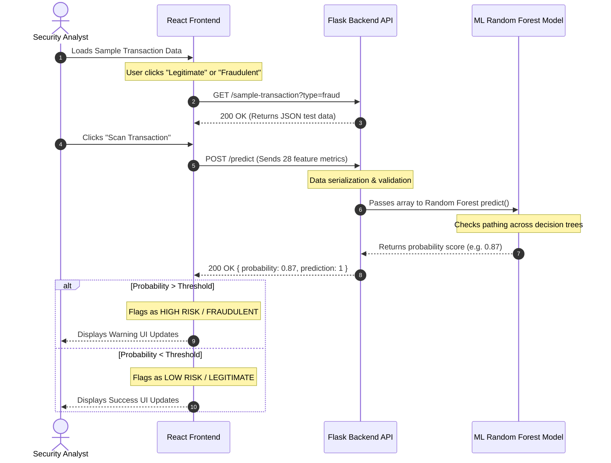

# NexusGuard Platform Documentation

> [!IMPORTANT]
> NexusGuard is a full-stack, enterprise-grade machine learning platform designed to provide real-time predictive analysis on credit card transactions to prevent fraud.

## 1. Executive Summary

NexusGuard replaces legacy batch-processing fraud mechanisms with an instantaneous, AI-driven assessment tool. By providing a beautiful **MERN-style** inspired frontend dashboard powered by React and Vite, non-technical analysts can easily scan, simulate, and observe fraud behavior. On the backend, a robust Python API proxies requests to a tightly tuned Random Forest Machine Learning Model, completing the assessment lifecycle in mere milliseconds.

---

## 2. Platform Architecture 

The application utilizes a monorepo setup to maintain parity between model deployments, backend APIs, and UI layers.

### Technology Stack
| Layer | Tech Used | Purpose |
| ---- | --------- | --------- |
| **Frontend** | React, Vite | Provides the responsive dashboard UI |
| **Backend API** | Python, Flask, Flask-CORS | Handles data normalization and acts as the model interface |
| **AI / ML** | Scikit-Learn, Pandas, NumPy | Handles the mathematical scoring and predictions |
| **Analysis** | Jupyter Notebooks | For data exploration, statistical analysis, and feature engineering |

---

## 3. High-Level Workflow Architecture

The diagram below illustrates the exact path a transaction takes from the moment an analyst interacts with the UI, to the moment a fraud score is confidently rendered on the screen.



---

## 4. Frontend Application Layer (`client/`)

The frontend guarantees a modern, dark-mode premium aesthetic to ensure maximum observability without eye strain. 

> [!TIP]
> The primary interactions occur on the **Scanner Page**, which securely handles data rendering and allows users to push the features array down the pipeline.

**Core Views:**
1. **Dashboard**: High-level system overview. Confirms model connection and tallies stats.
2. **Scanner**: The execution station. Allows pulling of fake testing records to emulate realtime transactions, sending them to the execution layer.
3. **Analytics**: Statistical representation of model outcomes over time.

---

## 5. Backend Server Layer (`server/`)

The Flask layer abstracts away the complexity of Python memory management required by Scikit-Learn.

> [!NOTE]
> The backend acts natively as a stateless API—it unpacks HTTP JSON requests, turns them into NumPy arrays (`X_test`), and passes them directly to the `model.pkl` binary file.

### Complete API Overview

1. **`GET /` (Health Check)**
   - Simply returns the "online" status of the server.
2. **`GET /sample-transaction`** 
   - Uses the attached `check_data.py` logic to randomly sample the physical dataset stored in `data/creditcard.csv` and returns a real piece of history.
3. **`POST /predict`**
   - The flagship API layer. Takes the 28 numerical traits of the transaction and forces a prediction.

---

## 6. Machine Learning Layer (`model/` & `notebooks/`)

The system relies on a pre-trained **Random Forest Classifier** exposed as a serialized Pickle object (`model.pkl`). 

The original dataset is the well-known **Kaggle Credit Card Fraud Detection Set**, consisting of 284,808 transactions (highly imbalanced). The features `V1` through `V28` were generated through PCA (Principal Component Analysis) to ensure raw PII (Personally Identifiable Information) like credit card numbers were scrubbed prior to ML analysis.

> [!IMPORTANT]
> The research notebook `CreditCardFraudDetection.ipynb` validates the data via Generalized Linear Models (logit regressions) before training the multi-tree ensemble, ensuring maximum precision and recall optimization.

---

## 7. How to Setup and Run Locally

To spin up this development environment, duplicate the physical server nodes by using dual terminals.

### 1. Terminal A (The Backend)
```bash
# 1. Enter the directory
cd server
# 2. Activate the model environment (Windows)
..\.venv\Scripts\activate
# 3. Spin up the cluster
python app.py
```
> Server defaults to: `http://localhost:5000`

### 2. Terminal B (The Frontend)
```bash
# 1. Enter the directory
cd client
# 2. Re-verify NPM packages
npm install
# 3. Spin up the interface
npm run dev
```
> Web application defaults to: `http://localhost:5173`
